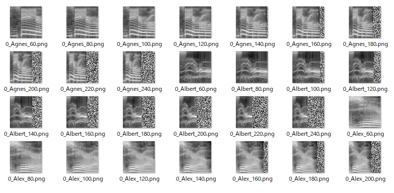
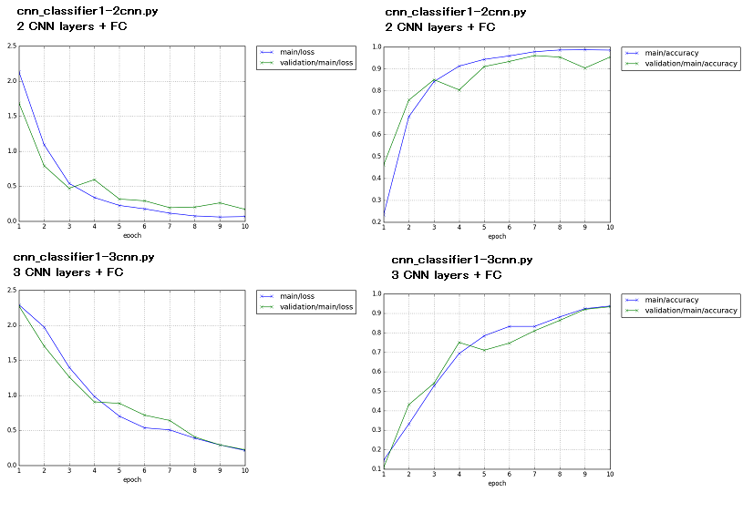
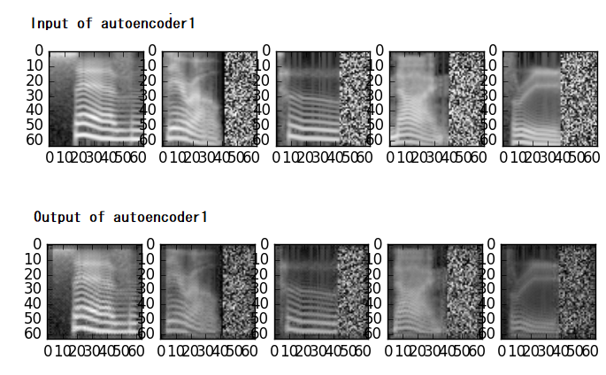
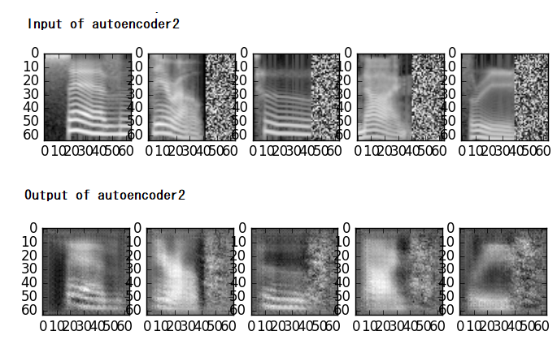
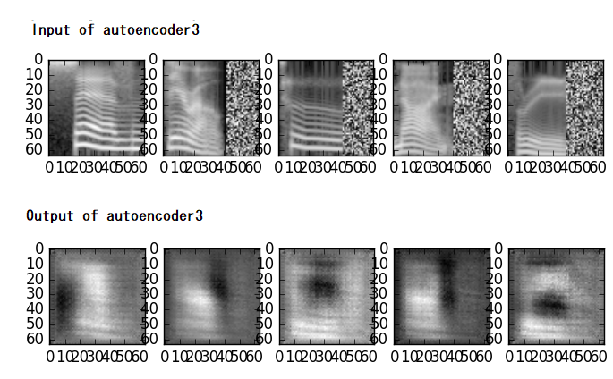
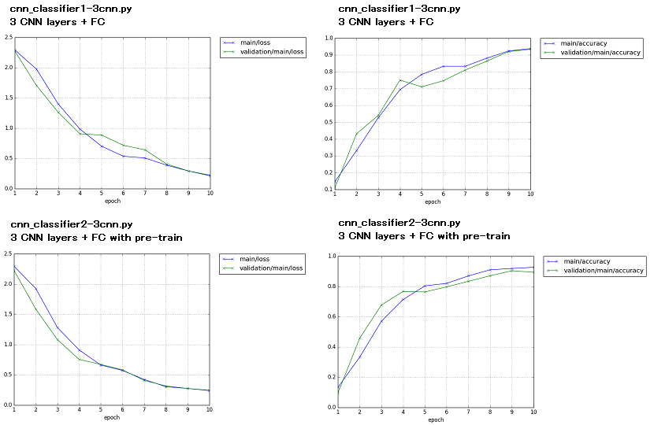

# スペクトログラム、オートエンコーダ  

## 概要  

メル尺度のスぺクトログラムの作成、オートエンコーダによる事前学習、などの練習用。  
ディープラーニングのフレームワークは Chainerを使用。 

[github repository](https://github.com/shun60s/Spectrogram_Autoencoder)  

## 使い方
### 1.メル尺度のスペクトログラムの作成  

数字の発話（英語）のWAVEファイルをダウンロードする。<http://pannous.net/files/spoken_numbers_wav.tar>  
 (データの中身の情報 <https://github.com/AKBoles/Deep-Learning-Speech-Recognition/blob/master/Pannous-Walkthrough.md> )  
 wavディレクトリーに移動する。ファイル名称の中にSteffi（名前）が含まれるデータは除いた。 
```
python make_spectrogram.py
```
フィルターバンクの数や、使用する周波数の幅、フレーム分析長さ（FFTの次数、シフト値）なども可変設定できる。 
WAVファイルの発話の速さ（例　40未満または260以上 ）の条件で排除できる。 spectrogramディレクトリーに出力される。 
spectrogram.zipは出力された例。
  


### 2.データセットの作成  

スペクトログラムから訓練用とテスト用のデータを準備する。
```
python make_dataset.py
```
DataSetディレクトリーに訓練用とテスト用のデータセットが出力される。  


### 3.事前学習なしで分類してみる  

2層 CNN(Convolutional Neural Network) + FC（full connection)  モデル の場合  
```
python cnn_classifier1-2cnn.py
```
  
3層 CNN(Convolutional Neural Network) + FC（full connection)  モデル の場合  
```
python cnn_classifier1-3cnn.py
```

  
上図は2層と3層の損失(loss)と正解率(accuracy)の比較。3層より2層モデルの方がよい結果となった。  
  

### 4.CNNのオートエンコーダーによる事前学習  

１層目のオートエンコーダーを学習する  
input->encoder->decoder->output  
```
python cnn_autoencoder1.py
```
  
上図は、オートエンコーダの入力とその出力の比較。 
  
2層目の学習  
前回で学習した値を使って、2層目を学習する。  
input>encoder(fixed)->encoder->decoder>decoder(fxied)->output  
```
python cnn_autoencoder2.py
```
  
上図は、オートエンコーダの入力とその出力の比較。 
  
3層目の学習  
前々回と前回で学習した値を使って、3層目を学習する。
input>encoder(fixed)->encoder(fixed)>encoder->decoder->decoder(fixed)->decoder(fixed)>output  
```
python cnn_autoencoder3.py
```
  
上図は、オートエンコーダの入力とその出力の比較。 
  

### 5.事前学習したものをつかった学習と分類  

事前学習した値をCNNの初期値として、3層CNN + FC モデルを学習する。
```
python cnn_classifier2-3cnn.py
```
  
分類性能は事前学習した方が立ち上がりが早いが、最終的な性能はディープラーニングの層数（構成）に依存するようです。  


## ライセンス  
melbank.pyは　それに記載されているライセンスに従うこと。  


## 参照したもの  

- [wav of Pannous, Description](https://github.com/AKBoles/Deep-Learning-Speech-Recognition/blob/master/Pannous-Walkthrough.md)
- [chainer dataset](https://qiita.com/tommyfms2/items/c3fa0cb258c17468cb30)
- [chainer deep autoencoder](https://qiita.com/nyk510/items/bb49e1ab8770f6bfb7d1)
- [chainer extension Evaluator](http://mizti.hatenablog.com/entry/2017/10/24/011003)
- [chainer extension DelGradient](https://qiita.com/ysasaki6023/items/3040fe3896fe1ed844c3)
- [chainer extension Updater](https://qiita.com/crcrpar/items/ea05aadeb15aff817546)


## 免責事項  
THE SOFTWARE IS PROVIDED "AS IS", WITHOUT WARRANTY OF ANY KIND, EXPRESS OR IMPLIED, 
INCLUDING BUT NOT LIMITED TO THE WARRANTIES OF MERCHANTABILITY, FITNESS 
FOR A PARTICULAR PURPOSE AND NONINFRINGEMENT. IN NO EVENT SHALL 
THE AUTHORS OR COPYRIGHT HOLDERS BE LIABLE FOR ANY CLAIM, DAMAGES OR OTHER LIABILITY, 
WHETHER IN AN ACTION OF CONTRACT, TORT OR OTHERWISE, ARISING FROM, 
OUT OF OR IN CONNECTION WITH THE SOFTWARE OR THE USE OR OTHER DEALINGS IN THE SOFTWARE.  
#### 上記はMITライセンスからの抜粋です。


